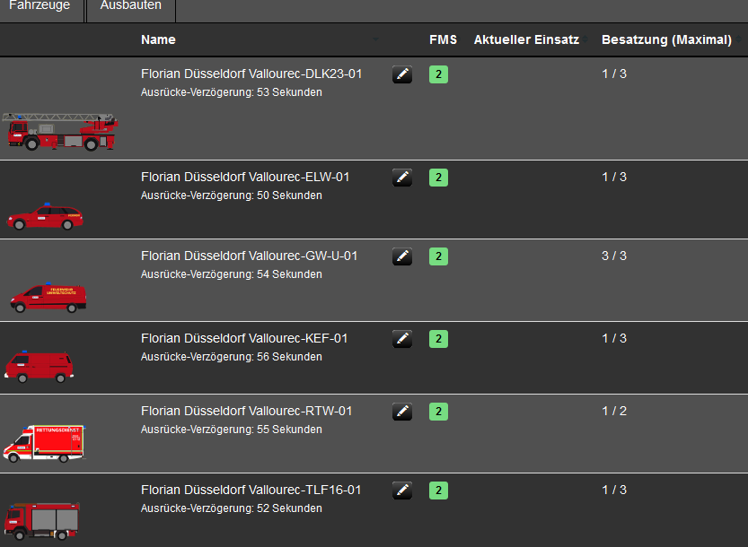

<h1>LSS Assigned Workers</h1>

Diese Script zeigt an, wie viel Personal einem Fahrzeug bereits zugewiesen wurden
und wie viel rest Platz es noch hat.

<h6>Diese Idee stammt von <a href="https://forum.leitstellenspiel.de/cms/index.php?user/7365-viperac/">ViperAC</a></h6>