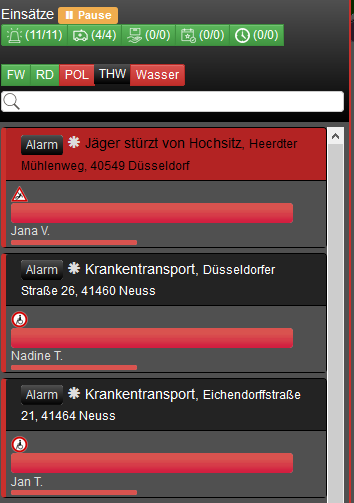

<h1>LSS Mission Filter by Requirements</h1>

Dieses Script filtert   

1. Einsatz ID 
2. Postleitzahl 
3. Adresse/Ort 

<h6>Diese Idee stammt von <a href="https://forum.leitstellenspiel.de/cms/index.php?user/7806-kuschi82/">Kuschi82</a></h6>