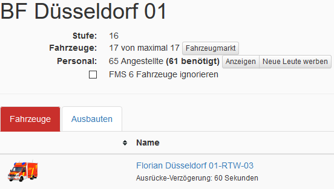

<h1>LSS Needed Workers</h1>

Dieses Script berechnet das mindest Personal um alle Fahrzeuge der Wache voll zu besetzen. 
Hier gillt die eingestellte Fahrzeug Kapazität und nicht die vom Spiel vorgegebene. 
Desweiteren kann man Fahrzeuge um FMS6 bei der berechnung ignorieren